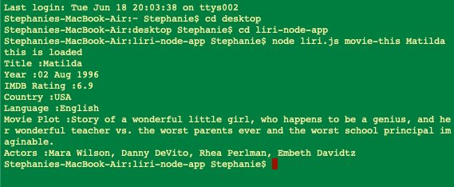
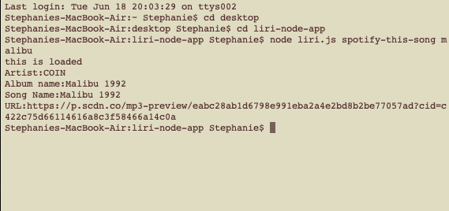
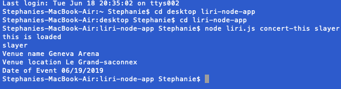

This is a text based app that allows for users to search using three primary commands. 

"concert-this" - will allow you to search for upcoming events from your favorite artist

"spotify-this-song" - will allow you to search for information regarding your favorite songs (one at a time)

"movie-this" - will allow for the user to search for a movie title and look at featured details, including the plot. 

1. To use the app begin by opening your terminal/bash

2. Within terminal/bash, navigate to the folder containing the liri.js file

3. Once in the folder put in the following command using your choice from above

    node liri.js "Your Choice of Command From List Above" "search term"

4. Keep reusing as you discover more you want to learn

--------------------The following are examples of my working code-------------------------

